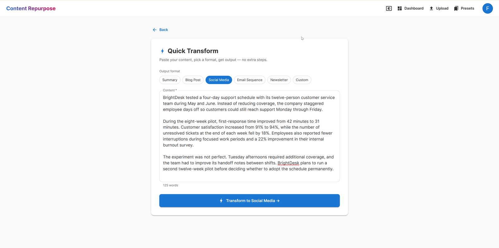
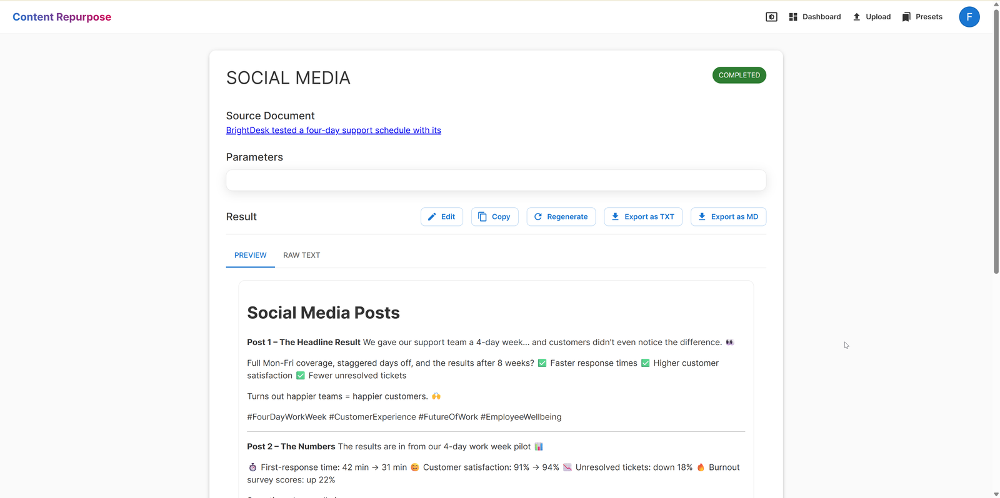
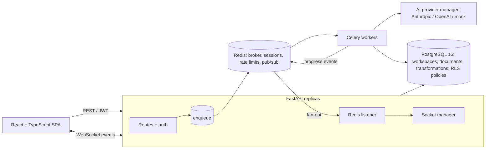

# Content Repurpose Platform

[](https://github.com/2bxtech/content-repurpose-platform/actions/workflows/ci.yml)

A multi-tenant web app that turns one piece of long-form content (a pasted draft, an uploaded PDF/DOCX, or a URL) into a blog post, social posts, an email sequence, a newsletter or a summary. Users work inside workspaces. Generation runs on background workers, and results stream back to the browser over WebSockets. The AI layer sits behind a provider abstraction with failover and per-call cost tracking.

**Live demo:** [DEMO_URL]

| Quick transform | Result with refine, export and live status |
|---|---|
|  |  |

## Architecture



**Flow for a transformation:**
1. `POST /api/transformations` validates access, stores a `PENDING` row, enqueues a Celery task, and returns immediately.
2. A worker atomically claims the row (`PENDING → PROCESSING`), reads the document text from Postgres, and calls the provider manager. The manager tries providers in priority order.
3. The worker records the result, tokens, cost and latency. It publishes `transformation_completed` to Redis.
4. Every API replica relays the event to the owner's WebSocket connections. The page updates without polling; polling remains as a fallback.

The deeper write-up, covering request lifecycle, data model and failure handling, is in [docs/ARCHITECTURE.md](docs/ARCHITECTURE.md).

## Key design decisions

- **Tenant isolation: app-level workspace filters, with Postgres RLS as a second layer.**
  - Every query is scoped by the `workspace_id` taken from the signed token. Integration tests assert that one tenant can't read another's documents, transformations or sockets.
  - RLS policies on every tenant table add a database-level backstop that doesn't depend on every query being written correctly.
  - *Current limitation:* the app connects as the table owner, so Postgres doesn't enforce those policies yet. Enforcing them means switching the app to a non-owner role (plus `FORCE ROW LEVEL SECURITY`). The workers already scope their connections for this.
- **Celery for AI calls.**
  - Generation takes seconds to minutes, costs money, and fails in provider-specific ways. Running it in the request would tie up API workers and lose work on timeouts.
  - The queue gives retries at the provider layer and an at-most-once billed call (the atomic claim). A beat sweeper fails jobs stuck past a deadline, so clients never poll forever.
  - `/quick` and `/refine` stay synchronous on purpose, because the user is waiting on that exact response.
- **Redis pub/sub for WebSocket fan-out.** A worker doesn't know which API replica holds a user's socket. Workers publish to one channel; each replica subscribes and delivers to its own sockets. That needs no sticky sessions, and a replica keeps working in local-only mode if Redis blips.
- **UUID primary keys everywhere.** IDs aren't enumerable (`/documents/3` tells you nothing about `/documents/4`), can be generated without a database round trip, and don't collide across environments.
- **Short-lived JWTs with refresh rotation.**
  - Access tokens last 15 minutes; refresh tokens last 7 days and carry a `jti` tracked in Redis.
  - Refreshing blacklists the old refresh token, logout revokes the session, and a stolen refresh token works at most once.
  - Browsers can't set headers on a WebSocket handshake, so the socket token travels in the query string. The access log redacts it.
- **Provider abstraction with a mock.** Anthropic and OpenAI implement one interface; the manager handles failover order, rate limiting and cost tracking. A mock provider lets the whole stack, and CI, run with no API keys. It is refused when `ENVIRONMENT=production`, so a misconfigured deploy fails loudly instead of returning canned text.

## Tech stack

| Layer | Technologies |
|---|---|
| API | Python 3.12, FastAPI, Pydantic v2, SQLAlchemy 2.0 (async) + asyncpg, Alembic |
| Background jobs | Celery 5.3 with Redis broker, Celery beat |
| Data | PostgreSQL 16 (row-level security policies), Redis 7 |
| AI | Anthropic and OpenAI SDKs behind a provider manager; mock provider for dev/CI |
| Auth | JWT (PyJWT) access + refresh with rotation, bcrypt, Redis-backed sessions and rate limits |
| Frontend | React 18, TypeScript, MUI 5, TanStack Query, React Router |
| Tooling | Docker Compose, Make, pytest, Jest, Ruff, GitHub Actions, gitleaks |
| Deploy | Railway (API + worker, Dockerfile), Vercel (frontend) |

## Quick start

Requirements: Docker, Make, Python 3.12, Node 22.

```bash
git clone https://github.com/2bxtech/content-repurpose-platform.git
cd content-repurpose-platform
cp .env.example .env    # optional: set CLAUDE_API_KEY or OPENAI_API_KEY (otherwise the mock provider is used)
make up                 # Postgres, Redis, API (applies migrations), Celery worker + beat
cd frontend && npm ci && npm start
```

- App: http://localhost:3000. Register, then try **Quick Transform**.
- API docs: http://localhost:8000/docs
- If ports 5433/6379/8000 are taken, override them, e.g. `API_HOST_PORT=8080 make up`.
- `make help` lists all targets, including `make api` / `make worker` for running the backend on the host with reload.

## Tests

```bash
make install            # venv with backend dev dependencies + frontend packages
make test               # backend unit tests (no services needed)
make test-integration   # builds an isolated compose stack, runs the full suite against it, tears it down
make lint
cd frontend && npm test
```

The integration suite drives the real stack. It checks that a transformation created over HTTP completes on the Celery worker and that its completion event arrives over the WebSocket. It also checks cross-tenant access over HTTP and WebSocket, operator-only endpoints, and security headers. CI runs all of the above plus a gitleaks scan on every PR. More detail is in [docs/TESTING.md](docs/TESTING.md).

## What I'd do next

- **Enforce RLS in Postgres:** connect as a non-owner role and add `FORCE ROW LEVEL SECURITY`, so the policies become enforced isolation.
- **Verify email addresses before they unlock anything sensitive.**
- **Per-workspace AI budgets on top of the existing per-call cost tracking.**
- **OpenTelemetry traces across API, queue and worker.**

## License

Source-available for review only. See [LICENSE](LICENSE). The build history is summarized in [docs/DEVELOPMENT_HISTORY.md](docs/DEVELOPMENT_HISTORY.md).
